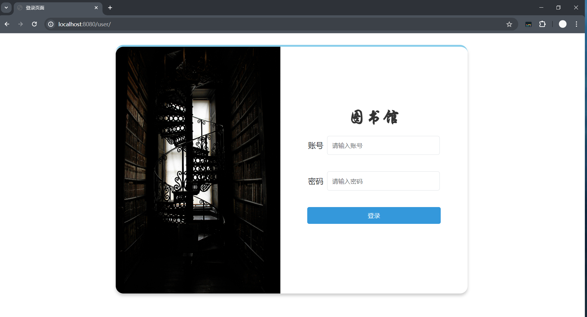
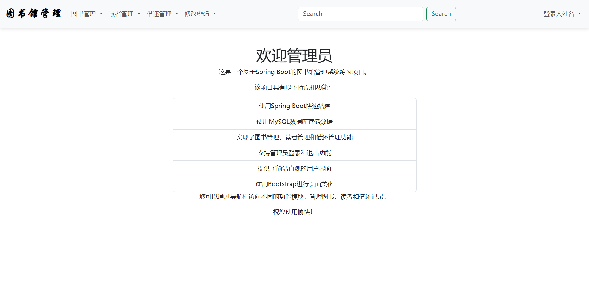
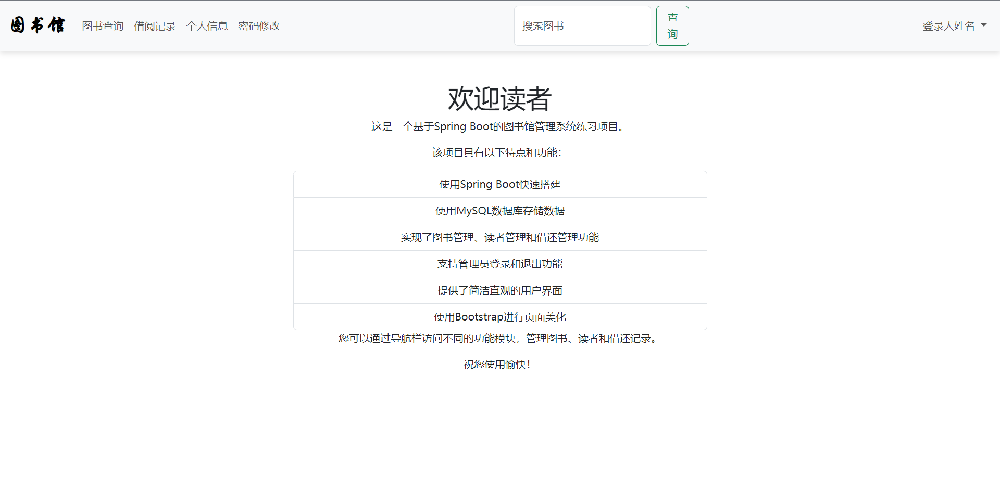
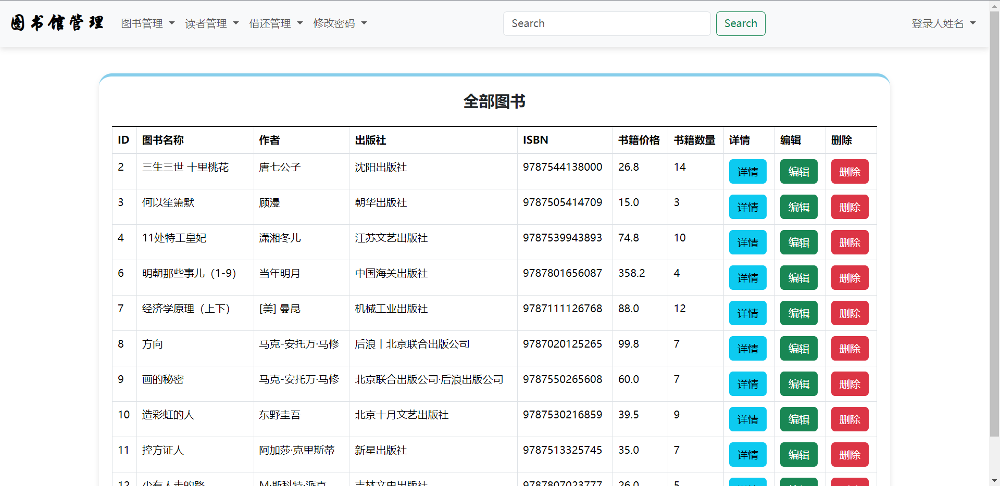
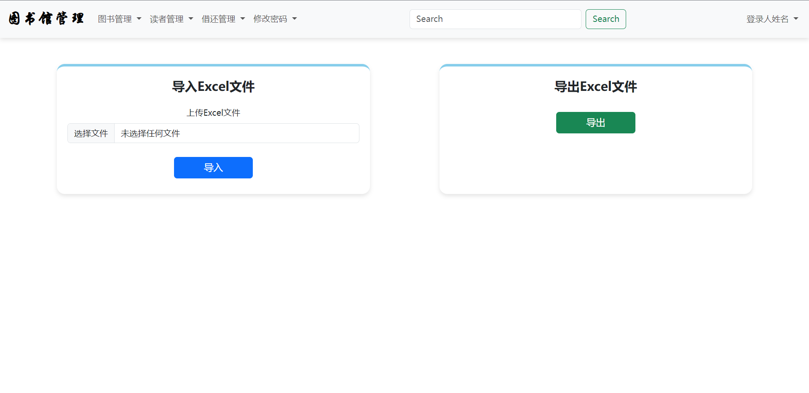
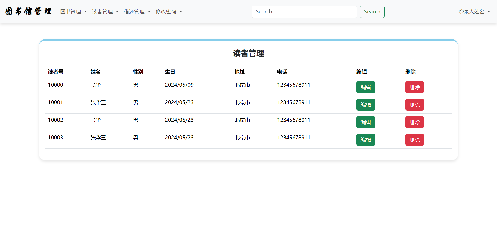
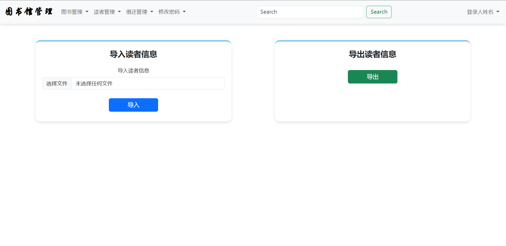
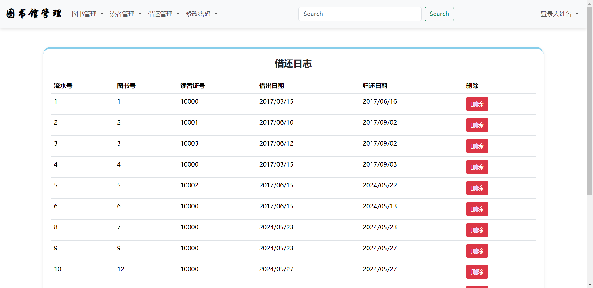

# 图书馆管理系统

### 基于SpringBoot、Maven、Mybatis

这是一个改进版本，将SSM项目改成SpringBoot项目
##### 这是原项目地址：[https://github.com/zhanghuanhao/LibrarySystem](https://github.com/zhanghuanhao/LibrarySystem)

### 开发环境 JDK17、 MySQL8.4、 SpringBoot2.6.6、 Maven3.8.8  

#### 启动项目输入：http://localhost:8080/user/ 跳转到登录页面

#### 登录成功后跳转到首页 管理员密码admin账号123456

#### 登录成功后跳转到首页 管理员密码张华账号123456

#### 图书管理页面，可以查阅详情，修改该图书信息，删除该图书信息

#### 添加图书，和导出图书信息

#### 管理读者信息

#### 导入导出读者信息

#### 借阅信息管理

该文件可以删除
src/main/resources/static/assets  

由于时间伧俗，搜索功能和用户名显示暂时没有实现，等有时间再进行优化

